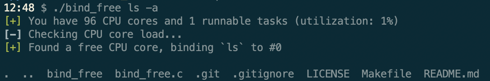

# bind free

Wrapper for starting and binding a program to a free CPU.  Mostly adapted from
the American Fuzzy Lop (AFL) fuzzer, so all credit goes to the AFL developers.

## Usage

```bash
make
./bind_free ls -a
```


